:author: Gwendal Daniel
:date: 2026-09-16
:status: proposed
:consulted: Mélanie Bats
:informed: Thibault Béziers La Fosse, Arnaud Dieumegard, Jérôme Gout, Mélanie Bats
:deciders: Mélanie Bats
:pitch: none

= ADR-002 - Define perspective and diagram service boundaries

== Context and Problem

An initial refactoring reduced duplicated semantic behavior between Capella perspectives.
Common behavior was moved to transverse services, while perspective-specific semantic services retained only the operations that differ for a given perspective.
During this refactoring, representation-level entry points were also removed when they only delegated to semantic operations and did not require representation context.

However, the current organization has two limitations.

First, perspective-level semantic services do not expose a complete API.
Callers must determine whether an operation is provided by a transverse service or by a perspective-specific service.
When a perspective-specific implementation of an existing transverse operation is introduced, existing callers receive no indication that they should use it and may continue to call the transverse behavior.

Second, representation-dependent operations do not have a consistent diagram-level boundary.
Existing representation services such as drop and reconnect are scoped to an entire perspective (for example, `LARepresentationReconnectToolServices`), although diagrams within that perspective may support different, potentially incompatible interactions.
Conversely, diagram creation and model-deletion tools, as well as semantic candidate expressions, may invoke semantic services directly, leaving no diagram-level boundary for restricting supported operations, use representation context, or provide user feedback.

We therefore need a service organization that provides a complete and stable semantic API for each perspective, backed by common implementations where appropriate.
It must also give each diagram an explicit interaction API that delegates semantic queries and mutations to the corresponding perspective API.

== Decision Drivers

The selected solution should:

* Provide a complete and stable semantic API for each Capella perspective, hiding whether a service is common or perspective-specific and allowing implementations to evolve without changing callers.
* Keep shared semantic behavior centralized and independent of representation concerns so it can be reused by diagrams, explorers, and other clients.
* Give each diagram an explicit API limited to its supported interactions, with access to representation context and consistent user feedback.
* Enforce a clear dependency direction from diagram services to perspective services and then to common services, so semantic constraints are applied consistently.

== Considered Options

=== Complete perspective APIs and diagram-specific representation services (selected)

Each Capella perspective exposes a complete semantic API organized into creation, deletion, move, query, and update services, covering every operation supported by that perspective.
When no specialization is required, these services delegate to common services.
This separation is materialized by two maven modules: `capella-model-common-services` contains common services used by all the perspectives, and `capella-model-services` contains perspective-level services.
These operations are also classified as queries or mutations.
Queries read semantic data without modifying the model and must not depend on mutation operations.
Creation, deletion, move, and update operations are mutations.

Each diagram exposes diagram-specific services for every supported operation, including creation, deletion, drop, reconnect, and semantic candidate lookup.
These services own representation concerns such as the editing context, diagram context, filtering, and user feedback, and delegate semantic queries and mutations to the perspective API.
Non-representation clients, such as the Capella bridge, use the perspective APIs directly.

The following diagram illustrates this organization.

.Capella service organization

Advantages:

* Perspective APIs remain stable when common behavior is specialized.
* Shared semantic behavior remains implemented in one place.
* Each diagram exposes only its supported representation behavior.

Drawbacks:

* Perspective APIs require delegate methods and must be kept complete as common behavior evolves.
* Existing callers must migrate away from direct common-service usage.

=== Direct common-service access with perspective-specific extensions

Clients and diagram services invoke common services for shared behavior and use a perspective service only when that perspective requires a different implementation.
Diagram-specific representation services can still be introduced, but they may delegate either to a common service or to a perspective service depending on the operation.

Advantages:

* Minimizes perspective delegate methods and migration from the current organization.
* Existing common services can continue to be used directly with little migration work.

Drawbacks:

* Callers must know where each operation is implemented and may continue using common behavior after a perspective-specific implementation is introduced.
* Common services become first-class semantic APIs, preventing the definition of complete, stable perspective APIs.

== Decision Outcome

In the context of improving the modularity of Capella services, facing the need to clarify the boundaries between common, perspective-specific, and diagram-specific behavior, we decided to introduce complete perspective semantic APIs and diagram-specific representation services.
We accept the additional delegate methods and migration effort required by this organization.

== Consequences

=== Advantages

* Clients use a stable perspective API without depending on whether behavior is common or perspective-specific.
* Shared semantic behavior remains centralized, with clear ownership across common, perspective, and diagram layers.
* Diagram services expose only supported interactions, consistently apply perspective constraints, and can provide diagram-specific feedback.
* Semantic services can be unit tested without requiring a Sirius Web representation.

=== Drawbacks

* Existing direct callers must be updated to use perspective-level services, and architecture service registration checks must prevent API bypasses and ambiguous AQL service resolution.
* Additional delegation layers make execution paths longer to debug.

== More Information

=== Implementation

We will first validate the feasibility of this refactoring on the OCB diagram:

* Complete the OA perspective API by creating the missing creation, deletion, move, query, and update service classes, delegating shared behavior to existing common semantic services.
* Create OCB diagram-level creation, deletion, drop, reconnect, and semantic candidate services that delegate semantic queries and mutations to the OA perspective API.
* Update the OCB diagram definition and service registration to use the new services and stop accessing common semantic services directly.
* Add or update architecture tests to ensure diagrams do not access common services directly, queries do not depend on mutations, and semantic services do not depend on representation-level types.

Once this approach has been validated, we will apply it incrementally to all perspectives and diagrams.
Explorers, forms, and tables should follow the same representation-level boundary when they require representation context or user feedback.
